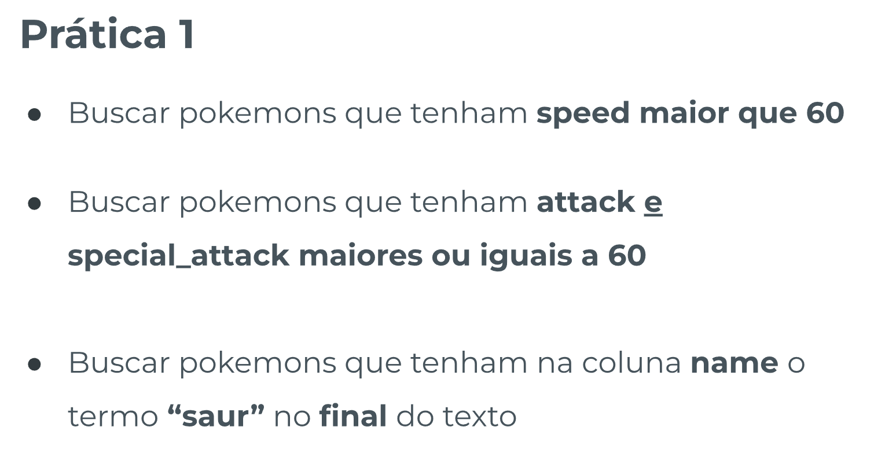
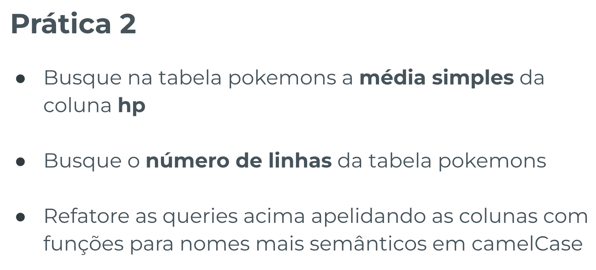
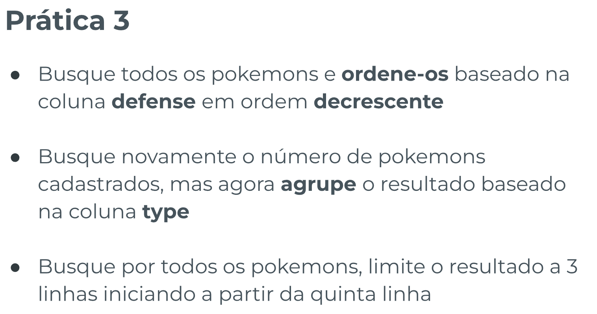
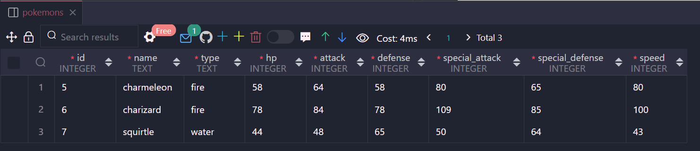
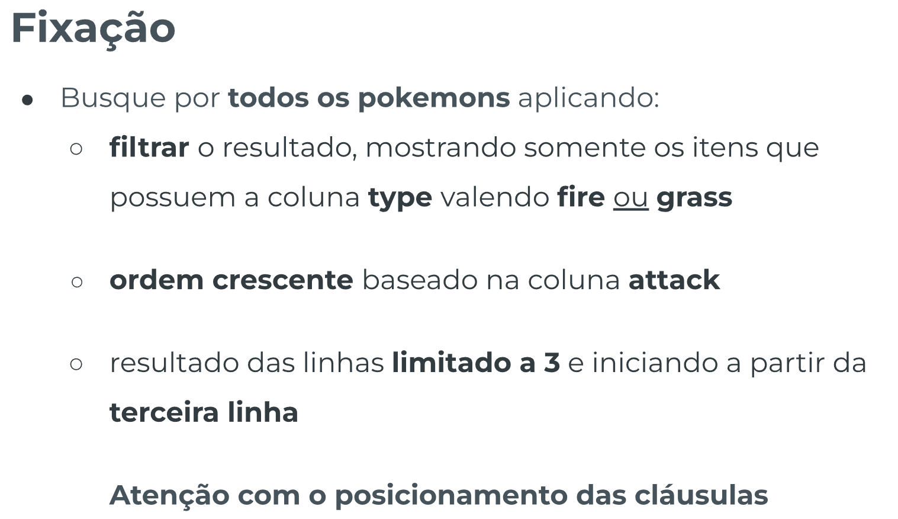
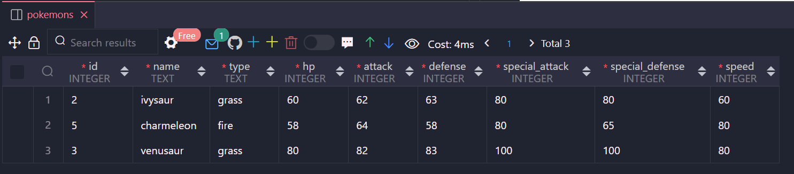

# Aprofundamento SQL

## Índice

-   [Prática Guiada 1](#prática-guiada-1)

    -   [Enunciado](#enunciado)
    -   [Resolução](#resolução)

-   [Prática Guiada 2](#prática-guiada-2)

    -   [Enunciado](#enunciado-1)
    -   [Resolução](#resoluc3a7c3a3o-1)

-   [Prática Guiada 3](#prática-guiada-3)

    -   [Enunciado](#enunciado-2)
    -   [Resolução](#resoluc3a7c3a3o-2)

-   [Fixação](#fixação)

    -   [Enunciado](#enunciado-3)
    -   [Resolução](#resoluc3a7c3a3o-3)
    -   [Extra](#extra)

## Prática Guiada 1

### Enunciado



### Resolução

```sql
-- PRÁTICA 1
-- parte 1
-- TODAS AS COLUNAS
SELECT * FROM pokemons
WHERE speed > 60

-- COLUNAS ESPECÍFICAS
-- SELECT name, id, speed FROM pokemons
-- WHERE speed > 60

-- parte 2
SELECT * FROM pokemons
WHERE attack >= 60 AND special_attack >= 60;

-- parte 3
SELECT * FROM pokemons
WHERE name LIKE '%saur';
```

## Prática Guiada 2

### Enunciado



### Resolução

`pratica-aprofundamento-sql.sql`

```sql
-- PRÁTICA 2

-- parte 1
SELECT AVG(hp)
FROM pokemons;

-- parte 2
SELECT COUNT(*) FROM pokemons;

-- parte 3
SELECT AVG(hp) AS 'mediaHP'
FROM pokemons;

SELECT COUNT(*) AS 'totalPokemons' FROM pokemons;

SELECT COUNT(id) AS 'totalPokemons' FROM pokemons;
```

## Prática Guiada 3

### Enunciado



### Resolução

```sql
-- PRÁTICA 3

-- parte 1
SELECT * FROM pokemons
ORDER BY defense DESC;

-- parte 2
SELECT COUNT(*), type
FROM pokemons
GROUP BY type

-- parte 3
-- O Offset começa A PARTIR DA PRÓXIMA LINHA
SELECT * FROM pokemons
LIMIT 3
OFFSET 4;

-- outra forma de fazer:
-- a partir do quinto limitando a 3
SELECT * FROM pokemons
LIMIT 4, 3;
```

RESULTADO:


## Fixação

### Enunciado



### Resolução

CÓDIGO:

```sql
-- FIXAÇÃO
SELECT * FROM pokemons
WHERE type = 'fire' OR type = 'grass'
ORDER BY attack ASC
LIMIT 2, 3;
```

RESULTADO:

